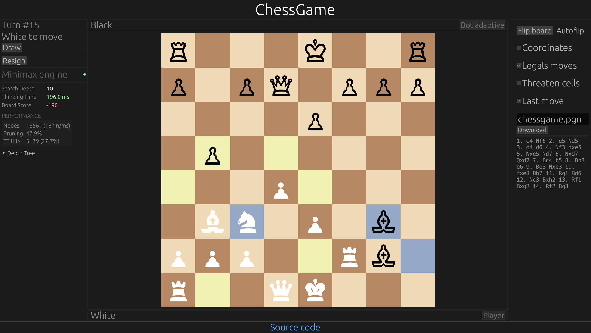
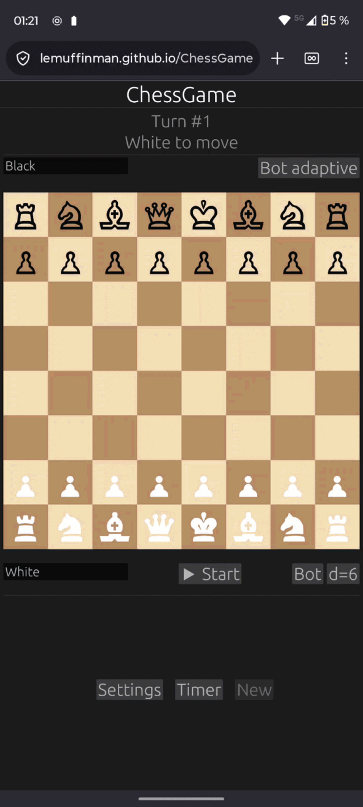
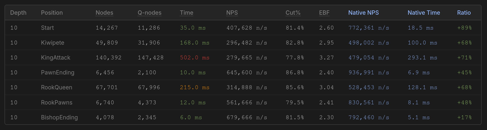

<td><h1>ChessGame ♟️</h1></td>
<td align="right">
  <strong><a href="https://lemuffinman.github.io/ChessGame/">▶ Play live demo</a></strong>
</td>

---

I built this project to learn Rust on something real, not exercises or tutorials. Chess felt like the right choice: the rules are complex enough to punish bad design (and they did), the algorithms are well-documented, and the Chess Programming Wiki became my bible over the intense sprints I spent on this project. Seeing how simple evaluation criteria can lead to natural openings, then improving until you get mated by the algorithm you built... that was quite the motivation to keep going. I now aim to integrate UCI to measure its Elo against other engines.

**A well-placed hint.**
A friend who suggested I give Rust a try pointed me toward one early design choice: model the board around `enum Cell { Occupied(Piece, Color), Free }`. That was enough to get started. Following that thread, I found myself reaching naturally for exhaustive pattern matching, `Option<Coord>` for en passant and check state where null is impossible by construction, traits for abstraction without overhead. Rust’s design makes good patterns feel obvious, and I gradually came to appreciate how much the language was guiding me.

**From 3 seconds to 300ms.**
Without parallelism on WASM or threads on native, the goal was to push depth as far as possible within a 300ms budget. What made it satisfying was that each bottleneck was measurable: clearing one felt like unlocking resources to invest in intelligence instead. The story starts at depth 5 taking 3 seconds, purest minimax with no pruning. Alpha-beta alone cut that by an order of magnitude. Move ordering (MVV-LVA, killers, history) pushed the branching factor down further. Replacing the per-leaf evaluation with an incremental score inside `apply` and `undo` removed that overhead entirely. Then a Transposition Table (1M entries in a fixed `Vec`, indexed by Zobrist hash, with generation counters) collapsed the tree on repeated positions. Depth 5 now runs in under 30ms, depth 11 around 300ms.

---

<p align="center">
  
</p>

## What it does

- **Play chess** — human vs human, human vs bot, or bot vs bot with all common chess features
- **Standard Timers** —  with standard time controls (blitz, rapid…) in human vs human games
- **AI opponent** — alpha-beta engine at configurable depth, three difficulty levels with iterative deepening
- **Hint system** — ask for the engine's best move suggestion at any point
- **Replay & PGN** — game replay and PGN export
- **Bench page** — standalone `bench.html` comparing performance across positions and depths (native vs WASM if running localy)
- **Portable** — WASM build runs in any browser on any device; native binary available for desktop and benchmarking
- **Responsive** — dedicated UI for desktop and mobile

<p align="center">
  
</p>

---

## Benchmarks

The project includes a standalone benchmark page (`bench.html`) that runs the engine against standard positions at increasing depths and reports nodes per second, effective branching factor, and quiescence node ratio.

The native vs WASM comparison requires a local setup — run `just bench-all` after cloning to generate `public/native_bench.json` and open `bench.html` in your browser. This comparison is not available on the live demo.

> **Note on reliability:** comparing native and WASM numbers is only meaningful on the same machine. Even then, WASM performance is harder to measure accurately: the browser introduces scheduling noise, lacks SIMD optimizations, and runs single-threaded in a sandboxed environment. Treat WASM NPS as a relative indicator across depths or positions — comparing it to native figures from a different machine has limited value.

<p align="center">
  
</p>

---

## Algorithms

See [docs/ALGORITHMS.md](docs/ALGORITHMS.md) for context and implementation notes on each technique.

<table>
<tr>
<td valign="top">

**Search**

| Technique | Ref |
|---|---|
| Alpha-Beta Pruning | [CPW](https://www.chessprogramming.org/Alpha-Beta) |
| Principal Variation Search | [CPW](https://www.chessprogramming.org/Principal_Variation_Search) |
| Iterative Deepening | [CPW](https://www.chessprogramming.org/Iterative_Deepening) |
| Aspiration Windows | [CPW](https://www.chessprogramming.org/Aspiration_Windows) |
| Null Move Pruning | [CPW](https://www.chessprogramming.org/Null_Move_Pruning) |
| Late Move Reductions (LMR) | [CPW](https://www.chessprogramming.org/Late_Move_Reductions) |
| Futility Pruning | [CPW](https://www.chessprogramming.org/Futility_Pruning) |
| Check Extensions | [CPW](https://www.chessprogramming.org/Check_Extensions) |
| Quiescence Search | [CPW](https://www.chessprogramming.org/Quiescence_Search) |
| Delta Pruning (in quiescence) | [CPW](https://www.chessprogramming.org/Delta_Pruning) |

**Hashing & memory**

| Technique | Ref |
|---|---|
| Zobrist Hashing (incremental) | [CPW](https://www.chessprogramming.org/Zobrist_Hashing) |
| Transposition Table (fixed Vec 1M) | [CPW](https://www.chessprogramming.org/Transposition_Table) |

</td>
<td valign="top">

**Move ordering**

| Technique | Ref |
|---|---|
| MVV-LVA | [CPW](https://www.chessprogramming.org/MVV-LVA) |
| Killer Move Heuristic | [CPW](https://www.chessprogramming.org/Killer_Move) |
| History Heuristic | [CPW](https://www.chessprogramming.org/History_Heuristic) |
| TT move ordering | [CPW](https://www.chessprogramming.org/Transposition_Table) |

**Evaluation**

| Technique | Ref |
|---|---|
| Piece-Square Tables (opening/endgame) | [CPW](https://www.chessprogramming.org/Piece-Square_Tables) |
| King Safety (pawn shield + attackers) | [CPW](https://www.chessprogramming.org/King_Safety) |
| Pin Detection | [CPW](https://www.chessprogramming.org/Pin) |
| Mop-up Evaluation | [CPW](https://www.chessprogramming.org/Mop-up_Evaluation) |
| King Corner Pressure | [CPW](https://www.chessprogramming.org/King_Centralization) |
| Rook & Bishop Cut Bonus | [CPW](https://www.chessprogramming.org/Rook_Endgames) |

</td>
</tr>
</table>

---
## Under the hood

See [docs/ARCHITECTURE.md](docs/ARCHITECTURE.md) for the full module breakdown.

```
src/
├── board/       — board representation, move generation, legality, pin detection
├── engine/      — alpha-beta, evaluators, TT, Zobrist, move ordering
├── game/        — GameState (turn, castling rights, en passant, draw conditions)
├── gui/         — egui panels and components
└── bin/
    └── bench.rs — native benchmark binary
lib.rs           — WASM entry point
main.rs          — native entry point
```

The `engine/` module has zero dependency on `egui`. It allows me to run a separate benchmark binary and keeps the path open for a future UCI implementation.


---
## Running locally

### Prerequisites

```bash
# Rust (https://rustup.rs)
curl --proto '=https' --tlsv1.2 -sSf https://sh.rustup.rs | sh

# WASM target
rustup target add wasm32-unknown-unknown

# Trunk (WASM bundler)
cargo install --locked trunk

# just (optional — recommended for convenience)
cargo install just
```

### Commands

`just` wraps `cargo` to handle compilation targets (WASM vs native) and debug/release profiles, and pipelines multi-step workflows. You can always use raw `cargo` commands instead.

```bash
# WASM — runs in the browser via trunk
just wasm          # dev server with hot-reload → http://127.0.0.1:8080
just wasm-release  # release build (optimized, use before benchmarking WASM)

# Native — runs as a desktop binary
just native        # debug build (fast compile, use during development)
just n             # release build (full optimizations, use for actual play)

# Bench — native vs WASM comparison
just bench-all     # generate native_bench.json then start WASM → bench.html

# Quality
just test          # cargo test
just clippy        # clippy for both native and wasm32 targets
```

See [docs/JUSTFILE.md](docs/JUSTFILE.md) for the full command reference.

### Dependencies

| Tool | Install | Purpose |
|---|---|---|
| `rustup` | [rustup.rs](https://rustup.rs) | Rust toolchain |
| `wasm32-unknown-unknown` | `rustup target add wasm32-unknown-unknown` | WASM compilation target |
| `trunk` | `cargo install --locked trunk` | WASM bundler and dev server |
| `just` *(optional)* | `cargo install just` | Task runner — QoL wrapper around cargo |

Key Rust dependencies: `eframe` / `egui` (GUI), `wasm-bindgen` + `web-sys` (WASM bridge), `chrono` (timers).

---

## Roadmap

### Next steps
- Exploring WebWorkers to parallelize the engine search, while keeping the setup as simple and serverless as possible (Cloudflare Pages is the current target, VPS as fallback)
- Separate UI loop and engine search into dedicated workers: bot thinking time is currently capped to avoid blocking the UI
- PGN import (SAN decoder)
- Further search optimizations I am evaluating:
  - SEE (Static Exchange Evaluation): evaluate capture sequences before exploring, significant move ordering gain
  - Lazy sort: score moves on demand instead of a full upfront sort

### Backlog
- UCI protocol support, to plug into tournament tools and Lichess for an official Elo rating
- Bitboard representation for the last major performance gain, enabling:
- Native multithreading for deeper search and WASM parallelism via WebWorkers

---

## Resources

**Rust**
- [The Rust Book](https://doc.rust-lang.org/book/)
- [Rust by Example](https://doc.rust-lang.org/rust-by-example/)
- [Other Rust Chess Engines](https://www.chessprogramming.org/Category:Rust)

**WebAssembly**
- [Rust and WebAssembly book](https://rustwasm.github.io/docs/book/)
- [wasm-bindgen docs](https://rustwasm.github.io/docs/wasm-bindgen/)

**Chess programming**
- [Chess Programming Wiki](https://www.chessprogramming.org/Main_Page)
- [Minimax](https://www.chessprogramming.org/Minimax) · [Alpha-Beta](https://www.chessprogramming.org/Alpha-Beta) · [Quiescence Search](https://www.chessprogramming.org/Quiescence_Search)
- [Transposition Table](https://www.chessprogramming.org/Transposition_Table) · [Zobrist Hashing](https://www.chessprogramming.org/Zobrist_Hashing)
- [rustic-chess — MVV-LVA](https://rustic-chess.org/search/ordering/mvv_lva.html)
- [Sebastian Lague Chess Coding Adventure](https://www.youtube.com/watch?v=U4ogK0MIzqk)

**Tools**
- [egui](https://github.com/emilk/egui)
- [trunk](https://trunkrs.dev/)
- [just](https://github.com/casey/just)
