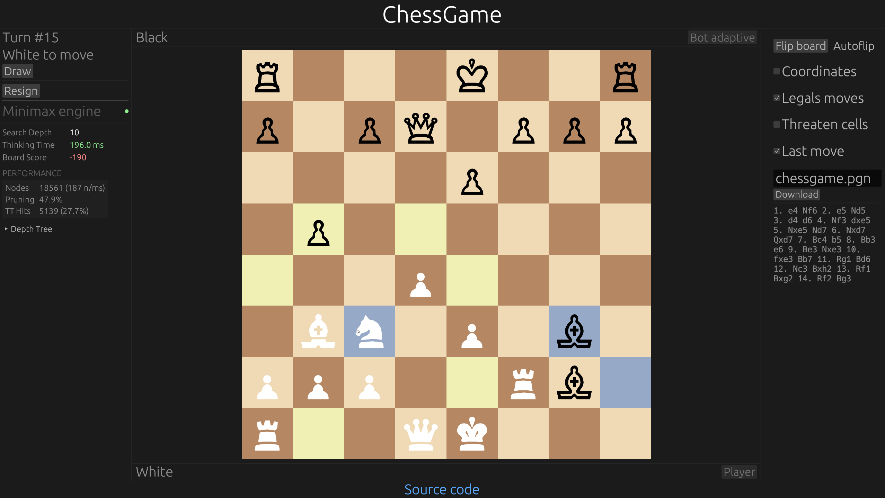
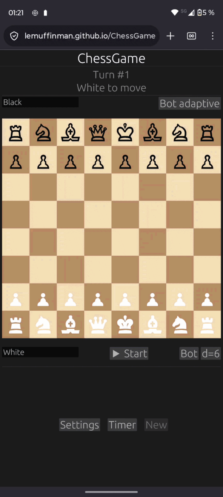
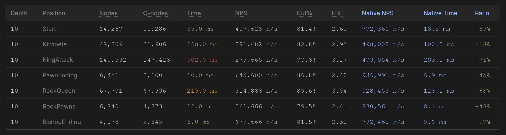

<table>
<tr>
<td><h1>ChessGame ♟️</h1></td>
<td align="right">
  <strong><a href="https://lemuffinman.github.io/ChessGame/">▶ Play live demo</a></strong>
  &nbsp;·&nbsp;
  <strong><a href="https://lichess.org/@/LeMuffinBot">♟ Play against me on Lichess</a></strong>
</td>
</tr>
</table>

---

I built this project to learn Rust on something real, not exercises or tutorials. Chess felt like the right choice: the rules are complex enough to punish bad design (and they did), the algorithms are well-documented, and the Chess Programming Wiki became my bible over the intense sprints I spent on this project. Seeing how simple evaluation criteria can lead to natural openings, then improving until you get mated by the algorithm you built... that was quite the motivation to keep going. The engine now speaks UCI, plays on [Lichess](https://lichess.org/@/LeMuffinBot) with bots of Elo 1900 - 2100, and its Elo is estimated 2050 against Stockfish 2000 elo with cutechess-cli on 1000 games.

**A well-placed hint.**
A friend who suggested I give Rust a try pointed me toward one early design choice: model the board around `enum Cell { Occupied(Piece, Color), Free }`. That was enough to get started. Following that thread, I found myself reaching naturally for exhaustive pattern matching, `Option<Coord>` for en passant and check state where null is impossible by construction, traits for abstraction without overhead. Rust's design makes good patterns feel obvious, and I gradually came to appreciate how much the language was guiding me.

**From 3 seconds to 300ms.**
The engine is deliberately single-threaded for now, the goal was to get the algorithm as efficient as possible before thinking about parallelism, which will complicate the native / wasm code division. With this this contraint, it was satisfying to see how each bottleneck was measurable: clearing one felt like unlocking resources to invest in intelligence instead. The story starts at depth 5 taking 3 seconds on the starting position in WASM, purest minimax with no pruning. Alpha-beta alone improved a lot the performances. Move ordering (MVV-LVA, killers, history) pushed the branching factor down further. Replacing the per-leaf evaluation with an incremental score inside `apply` and `undo` let us reach depth 9. Then a Transposition Table make us see the depths 12 - 16 depending of the tactic complexity of positions. In WASM. now Depth 5 at start position runs in under 30ms, depth 11 around 300ms.

---

<p align="center">
  
</p>

## What it does

- **Play chess** — human vs human, human vs bot, or bot vs bot with all common chess features
- **Standard timers** — with standard time controls (blitz, rapid…) in human vs human games
- **AI opponent** — alpha-beta engine at configurable depth, with adaptative time budget to prevent long ui freeze (until web workers implementation).
- **Hint system** — ask for the engine's best move suggestion at any point
- **Replay & PGN** — game replay and PGN export
- **Bench page** — standalone `bench.html` comparing performance across positions and depths (native vs WASM if running locally)
- **Portable** — WASM build runs in any browser on any device; native binary available for desktop and benchmarking
- **Responsive** — dedicated UI for desktop and mobile
- **Lichess bot** — the engine plays on [Lichess](https://lichess.org/@/LeMuffinBot) via the UCI protocol

<p align="center">
  
</p>

---

## Benchmarks

The project includes a standalone benchmark page (`bench.html`) that runs the engine against standard positions at increasing depths and reports nodes per second, effective branching factor, and quiescence node ratio.

The native vs WASM comparison requires a local setup, run `just bench-all 11` after cloning to generate `public/native_bench.json` and open `bench.html` in your browser. This comparison is not available on the live demo.

> **Note on reliability:** comparing native and WASM numbers is only meaningful on the same machine. Even then, WASM performance is harder to measure accurately: the browser introduces scheduling noise, lacks SIMD optimizations, and runs single-threaded in a sandboxed environment. Treat WASM NPS as a relative indicator across depths or positions, comparing it to native figures from a different machine has limited value.

<p align="center">
  
</p>

<td align="right">
  <strong><a href="https://lemuffinman.github.io/ChessGame/bench.html">▶ Bench in your browser</a></strong>
</td>

---

## UCI & Lichess bot

The engine exposes a `uci` binary (`src/bin/uci.rs`) that implements a subset of the [Universal Chess Interface](http://download.shredderchess.com/div/uci.zip) protocol — enough to plug into tournament tools and run on Lichess. The implementation is intentionally partial: it covers the commands actually needed in practice (`uci`, `isready`, `ucinewgame`, `position`, `go`, `stop`, `setoption`, `debug`). The full spec is documented in `src/bin/uci_requirements.txt`.

**Playing against other engines locally** requires [cutechess-cli](https://github.com/cutechess/cutechess) and a another engine to play with, i used [Stockfish](https://github.com/official-stockfish/Stockfish) compiling from source:

```bash
git clone https://github.com/official-stockfish/Stockfish
cd Stockfish/src
make -j profile-build
cp Stockfish ../../ && cd ../../
just test-uci              # one debug game vs Stockfish skill 0
just elo-uci 1500 100 4    # 100 games vs SF@1500, 4 concurrent
```

---

## Algorithms

See [docs/ALGORITHMS.md](docs/ALGORITHMS.md) for context and implementation notes on each technique.

<table>
<tr>
<td valign="top">

**Search**

| Technique | Ref |
|---|---|
| Alpha-Beta Pruning | [CPW](https://www.chessprogramming.org/Alpha-Beta) |
| Principal Variation Search | [CPW](https://www.chessprogramming.org/Principal_Variation_Search) |
| Iterative Deepening | [CPW](https://www.chessprogramming.org/Iterative_Deepening) |
| Aspiration Windows | [CPW](https://www.chessprogramming.org/Aspiration_Windows) |
| Null Move Pruning | [CPW](https://www.chessprogramming.org/Null_Move_Pruning) |
| Late Move Reductions (LMR) | [CPW](https://www.chessprogramming.org/Late_Move_Reductions) |
| Futility Pruning | [CPW](https://www.chessprogramming.org/Futility_Pruning) |
| Check Extensions | [CPW](https://www.chessprogramming.org/Check_Extensions) |
| Quiescence Search | [CPW](https://www.chessprogramming.org/Quiescence_Search) |
| Delta Pruning | [CPW](https://www.chessprogramming.org/Delta_Pruning) |

**Hashing & memory**

| Technique | Ref |
|---|---|
| Zobrist Hashing | [CPW](https://www.chessprogramming.org/Zobrist_Hashing) |
| Transposition Table | [CPW](https://www.chessprogramming.org/Transposition_Table) |

</td>
<td valign="top">

**Move ordering**

| Technique | Ref |
|---|---|
| MVV-LVA | [CPW](https://www.chessprogramming.org/MVV-LVA) |
| Killer Move Heuristic | [CPW](https://www.chessprogramming.org/Killer_Move) |
| History Heuristic | [CPW](https://www.chessprogramming.org/History_Heuristic) |
| TT move ordering | [CPW](https://www.chessprogramming.org/Transposition_Table) |

**Evaluation**

| Technique | Ref |
|---|---|
| Piece-Square Tables (opening/endgame) | [CPW](https://www.chessprogramming.org/Piece-Square_Tables) |
| King Safety (pawn shield + attackers) | [CPW](https://www.chessprogramming.org/King_Safety) |
| Pin Detection | [CPW](https://www.chessprogramming.org/Pin) |
| Mop-up Evaluation | [CPW](https://www.chessprogramming.org/Mop-up_Evaluation) |
| King Corner Pressure | [CPW](https://www.chessprogramming.org/King_Centralization) |
| Rook & Bishop Cut Bonus | [CPW](https://www.chessprogramming.org/Rook_Endgames) |

</td>
</tr>
</table>

---

## Under the hood

See [docs/ARCHITECTURE.md](docs/ARCHITECTURE.md) for the full module breakdown.

```
src/
├── board/       — board representation, move generation, legality, pin detection
├── engine/      — alpha-beta, evaluators, TT, Zobrist, move ordering
├── game/        — Game struct (turn, castling rights, en passant, draw conditions)
├── gui/         — egui panels and components
└── bin/
    ├── bench.rs — native benchmark binary
    └── uci.rs   — UCI interpretor binary
lib.rs           — WASM entry point
main.rs          — native entry point
```

The `engine/` and `game/` modules have zero dependency on `egui`. This is what makes it possible to run the engine headless as a benchmark binary or a UCI binary without touching the GUI.

---

## Running locally

### Prerequisites

```bash
# Rust (https://rustup.rs)
curl --proto '=https' --tlsv1.2 -sSf https://sh.rustup.rs | sh

# WASM target
rustup target add wasm32-unknown-unknown

# Trunk (WASM bundler)
cargo install --locked trunk

# just (optional — recommended for convenience)
cargo install just
```

**Optional — required for UCI commands only:**
- [cutechess-cli](https://github.com/cutechess/cutechess) — to run `just test-uci` and `just elo-uci`
- A `./stockfish` binary in the project root

### Commands

`just` wraps `cargo` to handle compilation targets (WASM vs native) and debug/release profiles. You can always use raw `cargo` commands instead.

```bash
# WASM — runs in the browser via trunk
just w             # release dev server → http://127.0.0.1:8080
just wasm-run-debug  # debug build (faster compile)

# Native — runs as a desktop binary
just n             # release build (full optimizations)
just native-run-debug  # debug build (faster compile)

# Bench
just bench-all 11  # generate native_bench.json then start WASM → bench.html

# UCI
just build-uci             # compile the UCI binary
just test-uci              # one game vs Stockfish (requires cutechess-cli)
just elo-uci 1500 100 4    # Elo estimate (requires cutechess-cli)

# Quality
just test      # cargo test
just clippy    # clippy for both native and wasm32 targets
just ci-fast   # build-uci + tests + bench regression
```

See [docs/JUSTFILE.md](docs/JUSTFILE.md) for the full command reference.

### Dependencies

| Tool | Install | Purpose |
|---|---|---|
| `rustup` | [rustup.rs](https://rustup.rs) | Rust toolchain |
| `wasm32-unknown-unknown` | `rustup target add wasm32-unknown-unknown` | WASM compilation target |
| `trunk` | `cargo install --locked trunk` | WASM bundler and dev server |
| `just` *(optional)* | `cargo install just` | Task runner — convenience wrapper around cargo |
| `cutechess-cli` *(optional)* | [github.com/cutechess/cutechess](https://github.com/cutechess/cutechess) | Run games between engines — needed for `test-uci` and `elo-uci` |

Key Rust dependencies: `eframe` / `egui` (GUI), `wasm-bindgen` + `web-sys` (WASM bridge), `chrono` (timers).

---

## Roadmap

### Next steps

- **Bitboard representation** — the current `[[Cell; 8]; 8]` board is not suited for multithreading and leaves performance on the table. I'm considering switching to bitboards as prerequisite for everything below, and probably the biggest refactor ahead.
- **WebWorkers (WASM)** — decouple the UI loop from the engine so the bot thinking no longer blocks the browser. The engine runs in a worker, the UI stays responsive.
- **Multithreading (native)** — once bitboards are in and the engine is thread-safe, parallelize the search on native.
- **WASM parallelism** — same goal as native multithreading, through WebWorkers + SharedArrayBuffer.
- **Further search optimizations:**
  - SEE (Static Exchange Evaluation): evaluate capture sequences before exploring, for a significant move ordering gain
  - Lazy sort: score moves on demand instead of a full upfront sort
  - ...

---

## Resources

**Rust**
- [The Rust Book](https://doc.rust-lang.org/book/)
- [Rust by Example](https://doc.rust-lang.org/rust-by-example/)
- [Other Rust Chess Engines](https://www.chessprogramming.org/Category:Rust)

**WebAssembly**
- [Rust and WebAssembly book](https://rustwasm.github.io/docs/book/)
- [wasm-bindgen docs](https://rustwasm.github.io/docs/wasm-bindgen/)

**Chess programming**
- [Chess Programming Wiki](https://www.chessprogramming.org/Main_Page)
- [Minimax](https://www.chessprogramming.org/Minimax) · [Alpha-Beta](https://www.chessprogramming.org/Alpha-Beta) · [Quiescence Search](https://www.chessprogramming.org/Quiescence_Search)
- [Transposition Table](https://www.chessprogramming.org/Transposition_Table) · [Zobrist Hashing](https://www.chessprogramming.org/Zobrist_Hashing)
- [rustic-chess — MVV-LVA](https://rustic-chess.org/search/ordering/mvv_lva.html)
- [Sebastian Lague Chess Coding Adventure](https://www.youtube.com/watch?v=U4ogK0MIzqk)
- [Stockfish](https://github.com/official-stockfish/Stockfish) — reference for bench positions, unit tests and UCI behaviour

**UCI protocol**
- [UCI specification](http://download.shredderchess.com/div/uci.zip) (ShredderChess) — the spec used to implement `src/bin/uci.rs`

**Tools**
- [egui](https://github.com/emilk/egui)
- [trunk](https://trunkrs.dev/)
- [just](https://github.com/casey/just)
- [cutechess-cli](https://github.com/cutechess/cutechess)
