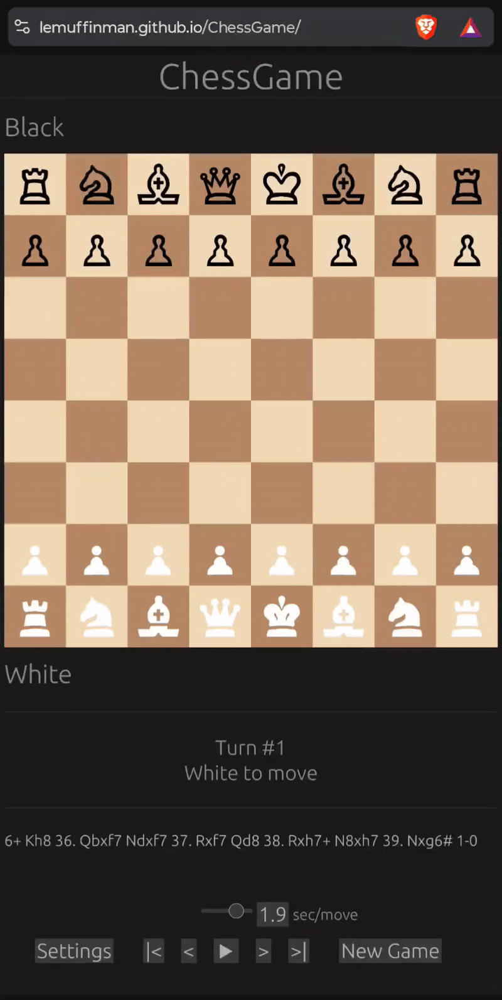

# ChessGame ♟️

ChessGame is a pedagogical project I created to learn Rust. Following some excellent advice, I also explored WebAssembly and CI/CD deployment along the way. The result is a playable chess game that runs directly in your browser.

At its core, the project focuses on move validation and a minimal graphical user interface built with egui. 
Compiling to WebAssembly allows the game to run directly in the browser, with the rust performances.
While the CI/CD pipeline gives me a first experience with modern deployment workflows for even a small, personal project.

Try it live on GitHub Pages: [https://lemuffinman.github.io/ChessGame/](https://lemuffinman.github.io/ChessGame/)

<p align="center">
  
  
</p>

---

## Goals

* Get into Rust programming through a real, interactive project.
* Explore WebAssembly for web deployment.
* Learn CI/CD workflows with GitHub Actions.
* Build a foundation for more advanced projects: AI, multiplayer, and full-stack chess platforms.

---

## Features

* Play a basic chess game with another player on the same browser.
* Different standards timing are available : blitz, rapid ...
* A basic replay mode.
* Encode and export pgn files.
  
* Modular Rust code for board, GUI, move validation, PGN handling ...
* CI/CD deployment using GitHub Actions and GitHub Pages.

* More to come ...
---

## Installation :
Some help to reproduce this setup at home :

Install rust as recommended by the [Rust official site](https://www.rust-lang.org/tools/install) : 
```bash
curl --proto '=https' --tlsv1.2 -sSf https://sh.rustup.rs | sh
```
Ensure you run ```cargo build``` to fetch and compile dependencies.

Install trunk if not installed yet : 
```bash
cargo install --locked trunk 
```
And run it with 
```bash
trunk serve 
```
Now, you can access the app in your browser at [http://127.0.0.1:8080/](http://127.0.0.1:8080/)

If you want to run your own program with WebAssembly, you need to edit your code to add a lib.rs file.

If you use rust, the lib.rs in this repos is a very basic implementation of a WebAssembly entry point.

You can use WebAssembly with several other langages, listed and documented on the [WebAssembly official site](https://webassembly.org/getting-started/developers-guide/).

Deprecracted branches exists to use ChessGame in native or cli versions, no need for trunk, run it with cargo only. 

```bash
cargo run
```

## CI/CD :
In the yml file you'll find my basic workflow to deploy my app on github pages at each push on main.

For now it only checks for formatting and warnings using amazings cargo tools ```clippy```, ```check``` and ```fmt```. Later I want to explore testing tools of cargo.

You would also need, on Github, to tweak you own repo settings : 

In Settings, Actions, Build and deployment :
- Source : deploy from a branch
- branch : gh-pages /root
  
Github will automatically create the gh-pages branch and release your compiled app on it.

By adding this yml file in a folder .github/workflows/deploy.yml, and pushing it on main, you will trigger the CI/CD, Github will do on a remote VM : 
- Install Rust and webasm dependencies.
- Check the project with cargo tools.
- Install trunk : this step could take some time, expect between 5 and 10 minutes of deployment.
- Build your app : doing so, trunk generate in dist folder the static site to run on an HTML page.
- Release dist folder on github pages.

Once deployed, you can visit your app with your favourite browser following this link base : [username].github.io/[Project_name]

---

## Roadmap 🛠️

1. Finish PGN export/import, add error handling and security.
2. Explore DevOps workflows and build a basic stack for development.
3. Add multiplayer support with matchmaking.
4. Implement basic move evaluation, and add AI opponent.
6. Build a backend for user registration, Elo system, rankings.

---


